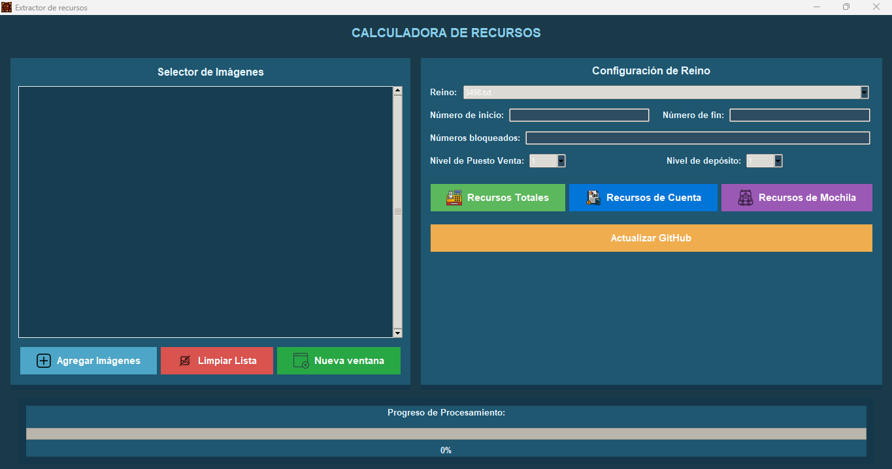
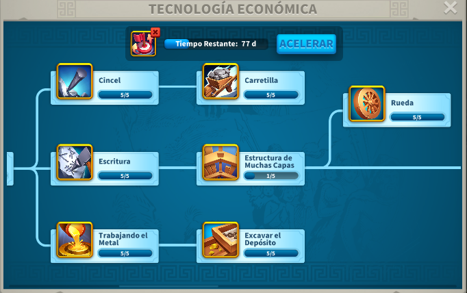

# RSS STORE APTAC - Calculadora de Recursos

**[English](README_en.md) | Español | [Português](README_pt.md) | [Tiếng Việt](README_vi.md) | [Bahasa Indonesia](README_id.md) | [Français](README_fr.md)**

Aplicación de escritorio para extraer automáticamente recursos de reinos desde capturas de pantalla usando OCR con generación inteligente de nicknames.

---

## 📖 Tabla de Contenidos

1. [Guía Rápida](#-guía-rápida)
2. [Cómo Tomar Capturas](#-cómo-tomar-capturas)
3. [Formatos de Entrada](#-formatos-de-entrada)
4. [Botones y Funciones](#-botones-y-funciones)
5. [Resultados y Guardados](#-resultados-y-guardados)
6. [Solución de Problemas](#-solución-de-problemas)
7. [Sistema de Actualización](#-sistema-de-actualización)

---

## 🚀 Guía Rápida

### Flujo Paso a Paso

1. **Abre la aplicación**
   - Ejecuta `RSS STORE APTAC.exe`
   - Selecciona el idioma en el menú principal

2. **Añade las imágenes**
   - Pulsa el botón `Agregar Imágenes`
   - Selecciona las capturas de pantalla de tus reinos
   - Las imágenes se cargan en la lista

3. **Configura el reino**
   - Elige el `Reino` en el selector desplegable
   - Los reinos disponibles se actualizan desde GitHub

4. **Rellena los números**
   - `Número de inicio`: Primer número de cuenta (ej: 1)
   - `Número de fin`: Último número de cuenta (ej: 30)
   - `Números bloqueados` (opcional): Cuentas a saltar (ej: 3,5,7)

5. **Establece los niveles**
   - `Nivel de ciudad`: Nivel del Puesto de Venta (1–25)
   - `Nivel de depósito`: Nivel del Almacén (1–25)

6. **Procesa los recursos**
   - Pulsa el botón del recurso que necesites:
     - `Recursos Totales`: Total por cuenta
     - `Recursos de Cuenta`: Valores netos
     - `Recursos de Mochila`: Solo inventario

7. **Encuentra los resultados**
   - Se guardan automáticamente en `GUARDADOS/`
   - Nombre: `REINO_results_YYYYMMDD_HHMMSS.txt`

## � Cómo Tomar Capturas

### Desde PC (Recomendado)

✅ **Lo correcto:**
- Abre el juego en modo ventana
- Captura la ventana de Recursos clara y legible
- Asegúrate que los números no estén recortados
- La imagen debe ser nítida sin sombras


**Consejos:**
- Usa la herramienta de captura de Windows (Win + Shift + S)
- Incluye solo el diálogo de recursos
- Números y etiquetas deben ser legibles

### Desde Móvil

⚠️ **Importante:**
1. Toma la captura en el móvil
2. **Transfiere al PC** (USB, Google Drive, Telegram, etc.)
3. Evita fotos anguladas o borrosas
4. La captura debe estar nítida y clara


**Recomendaciones:**
- Screenshot nativa del móvil (mejor que foto)
- Buena iluminación
- Sin reflejos o sombras
- Transferencia sin compresión

## 🔢 Formatos de Entrada

### Número de Inicio y Número de Fin

- **Solo dígitos**: `1` a `30` (ej: inicio=1, fin=30)
- **Deben ser enteros positivos**
- **El número de imágenes debe coincidir** con las cuentas válidas

### Números Bloqueados (Opcional)

**Dos formatos permitidos:**

**Formato 1: Rango**
```
1-10      → 1, 2, 3, 4, 5, 6, 7, 8, 9, 10
3-5       → 3, 4, 5
```

**Formato 2: Lista**
```
1,3,5,7   → 1, 3, 5, 7
3, 5, 8   → 3, 5, 8 (espacios permitidos)
```

**Formato 3: Mixto**
```
1-5,8,10-15  → 1, 2, 3, 4, 5, 8, 10, 11, 12, 13, 14, 15
```

### Ejemplo Práctico

| Campo | Valor | Resultado |
|-------|-------|----------|
| Inicio | 1 | Cuenta 1 |
| Fin | 10 | Cuenta 10 |
| Bloqueados | 3,5 | Procesa: 1,2,4,6,7,8,9,10 |
| Imágenes | 8 | ✅ Válido (coinciden) |

⚠️ Si el número de imágenes ≠ cuentas válidas, verás un error.

### Niveles

- `Nivel de Ciudad` (Puesto de Venta): 1-25
- `Nivel de Depósito` (Almacén): 1-25


## 🎯 Botones y Funciones

### Agregar Imágenes
- Abre el selector de archivos
- Selecciona múltiples capturas
- Se añaden a la lista de procesamiento

### Limpiar Lista
- Vacía todas las imágenes cargadas
- Borra datos temporales
- Útil para iniciar un nuevo lote

### Nueva Ventana
- Abre otra instancia de la aplicación
- Útil para procesar en paralelo

### Recursos Totales
- Extrae el **total de recursos** por cuenta
- Suma: Comida, Madera, Piedra, Oro
- Guardar: `REINO_results_YYYYMMDD_HHMMSS.txt`

### Recursos de Cuenta
- Extrae recursos **netos por cuenta**
- Resta items si aplica según OCR
- Guardar con formato detallado

### Recursos de Mochila
- Extrae **solo valores de inventario**
- Items "de objetos" (paquetes)
- Útil para auditoría de mochila

### Actualizar GitHub
- Descarga `kingdoms/` e `Iconos/` del repositorio
- Sobrescribe datos locales
- En .exe: muestra link a descargar nuevo instalador



---

## 💾 Resultados y Guardados

### Ubicación de Archivos

```
GUARDADOS/
├── REINO_results_20260602_143022.txt
├── REINO_results_20260602_145015.txt
└── REINO_results_20260603_101530.txt
```

### Formato del Archivo

```
Nickname: Account_1
Nivel de ciudad: 15
Nivel de depósito: 18
Comida: 45.0K
Madera: 32.5K
Piedra: 28.7K
Oro: 5.6K
---
Nickname: Account_2
Nivel de ciudad: 15
Nivel de depósito: 18
Comida: 41.2K
Madera: 35.1K
Piedra: 26.8K
Oro: 6.1K
---
```

### Cómo Usar los Resultados

1. Abre el archivo `.txt` en el editor
2. Copia los datos que necesites
3. Pégalo en tu herramienta de gestión
4. Los nicknames se generan automáticamente

---

## 🆘 Solución de Problemas

### "No se pueden detectar 4 valores"

**Causa:** La imagen no es clara o los números no se ven correctamente.

**Soluciones:**
1. Verifica que la captura sea **nítida**
2. Recorta la imagen si tiene elementos extras
3. Aumenta la resolución de la captura
4. Intenta con idioma inglés del juego

### "Lógica de la aplicación no válida"

**Causa:** El número de imágenes no coincide con las cuentas a procesar.

**Soluciones:**
1. Verifica: `fin - inicio + 1 - bloqueados = imágenes`
2. Ejemplo: `30 - 1 + 1 - 2 = 28` (necesitas 28 imágenes)
3. Añade o elimina imágenes según sea necesario

### "Error de actualización"

**Causa:** Problemas de conexión o repositorio mal configurado.

**Soluciones:**
1. Verifica tu conexión a Internet
2. Intenta de nuevo en unos minutos
3. Reinicia la aplicación
4. Comprueba que el repositorio GitHub existe

### Las imágenes no se procesan

**Causa:** Configuración incompleta.

**Soluciones:**
1. ¿Seleccionaste reino? (menú desplegable)
2. ¿Son válidos los números? (revisar formato)
3. ¿Tienes suficientes imágenes?

---

## 🔄 Sistema de Actualización

### Automática
- La app **verifica versiones nuevas al iniciar**
- Si hay actualización disponible, notificación
- Descarga automática desde GitHub
- Instalación sin intervención

### Manual
- Ejecuta `actualizar.bat` en la carpeta de instalación
- Se actualiza directamente desde el repositorio

### Qué se Actualiza
- `kingdoms/` → Nuevas plantillas
- `Iconos/` → Nuevos iconos
- Versión .exe → Desde Releases

---

## 📋 Niveles Disponibles

### Nivel de Ciudad (Puesto de Venta)
- Rango: 1 a 25
- Aplica a todos los recursos
- Se guarda en resultados


### Nivel de Depósito (Almacén)
- Rango: 1 a 25
- Almacenamiento disponible
- Se guarda en resultados


### Tecnología Máxima
- Afecta capacidad de recursos
- Referencia en la app



---

## 🎯 Ejemplo Completo

**Escenario:** Tienes 5 cuentas, quieres sacar recursos totales

1. **Prepara capturas**
   - Toma 5 screenshots (una por cuenta)
   - Transfiere al PC
   - Guarda en carpeta accesible

2. **Configura la app**
   - Agregar Imágenes → selecciona 5
   - Reino → elige correcto
   - Número inicio: 1
   - Número fin: 5
   - Números bloqueados: (vacío)
   - Nivel ciudad: 15
   - Nivel depósito: 18

3. **Procesa**
   - Pulsa `Recursos Totales`
   - Espera a que termine
   - Verás progreso en %

4. **Resultados**
   - Archivo guardado automáticamente
   - Abre `GUARDADOS/REINO_results_*.txt`
   - Copia datos a tu herramienta

---

## 📝 Requisitos del Sistema

- **SO:** Windows 10 o posterior
- **Python:** No necesario (incluido en .exe)
- **OCR:** Tesseract (incluido en instalador)
- **Internet:** Para actualizaciones (no obligatorio)

## 🔐 Privacidad y Seguridad

✅ **Garantizado:**
- Funciona **100% offline**
- Imágenes **nunca se envían** a servidores
- **No requiere registro** ni cuenta
- **Tus datos permanecen** en tu PC
- **Código abierto** (GPL-3.0)

---

## 📞 Soporte

- **GitHub Issues:** https://github.com/Aptac0/Resource-Calculator/issues
- **Releases:** https://github.com/Aptac0/Resource-Calculator/releases
- **Código Fuente:** https://github.com/Aptac0/Resource-Calculator

---

**Versión:** 1.0.0  
**Última actualización:** Junio 2026  
**Licencia:** GPL-3.0
