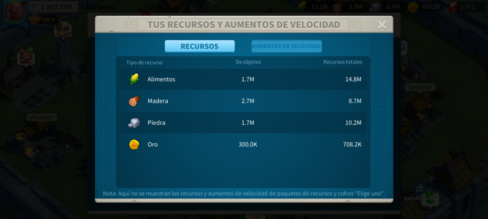
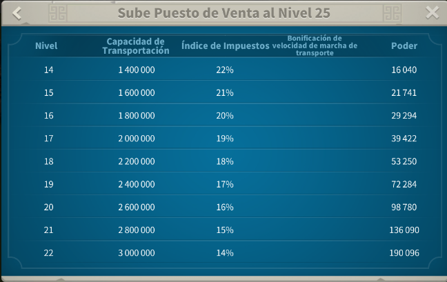
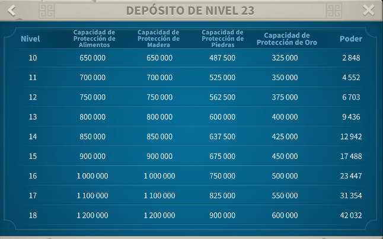

# RSS STORE APTAC - Kalkulator Sumber Daya

**[Español](README_es.md) | [English](README_en.md) | [Português](README_pt.md) | [Tiếng Việt](README_vi.md) | Bahasa Indonesia | [Français](README_fr.md)**

---

## 📱 Apa itu RSS STORE APTAC?

Aplikasi desktop untuk mengekstrak sumber daya kerajaan dari tangkapan layar secara otomatis menggunakan teknologi OCR dengan manajemen akun yang cerdas.

## ✨ Fitur

- ✅ Ekstraksi sumber daya otomatis dengan OCR
- 🎯 Antarmuka multibahasa (6 bahasa didukung)
- 🔄 Pembaruan otomatis dari GitHub
- 📊 Pemrosesan batch (hingga 100 gambar)
- 💾 Ekspor ke file TXT/CSV
- 🌍 Semua pesan menghormati bahasa pilihan Anda

## 🚀 Instalasi Cepat

1. Unduh `RSS_STORE_APTAC_Installer.exe` dari [Releases](https://github.com/Aptac0/Resource-Calculator/releases)
2. Jalankan penginstal
3. Selesai! Aplikasi akan diperbarui secara otomatis saat versi baru tersedia

## 📖 Panduan Pengguna

### Alur Cepat

1. **Buka aplikasi:** Jalankan `RSS STORE APTAC.exe`
2. **Tambah gambar:** Klik "Tambah Gambar" dan pilih tangkapan layar Anda
3. **Pilih kerajaan:** Pilih kerajaan yang sesuai dari menu tarik-turun
4. **Konfigurasi nomor:**
   - `Nomor awal`: Nomor akun pertama (mis: 1)
   - `Nomor akhir`: Nomor akun terakhir (mis: 30)
   - `Nomor terblokir`: (opsional) Nomor untuk dilewati (mis: 3,5,7)
5. **Atur level:** Pilih "Level Kota" dan "Level Gudang" (1-25)
6. **Proses:** Klik tombol sumber daya yang Anda butuhkan

### Cara Mengambil Tangkapan Layar

#### Dari PC (Direkomendasikan)
- Buka game dalam mode jendela
- Ambil tangkapan layar jelas dari jendela Sumber Daya
- Pastikan angka dan label dapat dibaca


#### Dari Ponsel
- Pindahkan gambar ke PC (USB, Google Drive, dll.)
- Hindari foto miring atau buram
- Pastikan gambar tajam dan jelas



### Format Masukan

#### Nomor Awal dan Akhir
- Hanya angka (mis: `1` dan `30`)
- Harus berupa bilangan bulat positif yang valid

#### Nomor Terblokir (Opsional)
Dua format tersedia:
- **Rentang:** `1-10` (semua angka dari 1 hingga 10)
- **Daftar:** `1,3,5,7` (angka spesifik)
- **Campuran:** `1-5,8,10-15`

**Contoh:**
- `awal=1`, `akhir=10`, `terblokir=3,5` → proses: 1,2,4,6,7,8,9,10
- Aplikasi memvalidasi bahwa Anda memiliki cukup gambar

#### Level
- `Level Kota` (Pasar): 1-25
- `Level Gudang` (Penyimpanan): 1-25




## 🔄 Sistem Pembaruan

### Otomatis
Aplikasi memeriksa versi baru saat startup. Jika ditemukan:
- Anda akan mendapat notifikasi
- Unduh langsung dari aplikasi
- Instalasi otomatis

### Manual
Jalankan `actualizar.bat` dari folder instalasi

## 💾 Hasil dan File Tersimpan

### Lokasi File

```
GUARDADOS/
├── REINO_results_20260602_143022.txt
├── REINO_results_20260602_145015.txt
└── REINO_results_20260603_101530.txt
```

### Format File

```
Nickname: Account_1
Level Kota: 15
Level Gudang: 18
Makanan: 45.0K
Kayu: 32.5K
Batu: 28.7K
Emas: 5.6K
---
Nickname: Account_2
Level Kota: 15
Level Gudang: 18
Makanan: 41.2K
Kayu: 35.1K
Batu: 26.8K
Emas: 6.1K
---
```

### Cara Menggunakan Hasil

1. Buka file `.txt` di editor
2. Salin data yang Anda butuhkan
3. Tempel ke alat manajemen Anda
4. Nama panggilan dibuat secara otomatis

---
