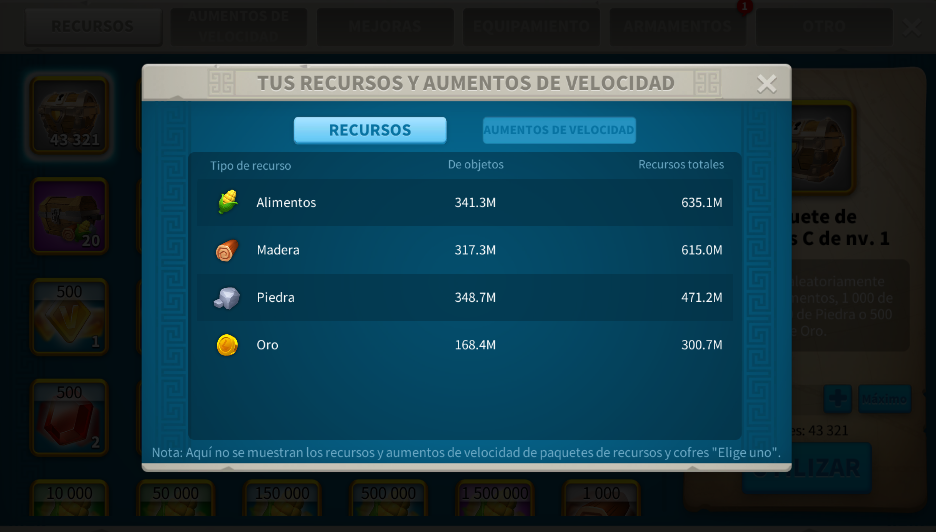

# RSS STORE APTAC - Máy Tính Tài Nguyên

**[Español](README_es.md) | [English](README_en.md) | [Português](README_pt.md) | Tiếng Việt | [Bahasa Indonesia](README_id.md) | [Français](README_fr.md)**

Ứng dụng máy tính để tự động trích xuất tài nguyên vương quốc từ ảnh chụp màn hình bằng OCR với tạo tên phụ thông minh.

---

## 📖 Mục lục

1. [Hướng dẫn nhanh](#-hướng-dẫn-nhanh)
2. [Cách chụp màn hình](#-cách-chụp-màn-hình)
3. [Định dạng đầu vào](#-định-dạng-đầu-vào)
4. [Nút và chức năng](#-nút-và-chức-năng)
5. [Kết quả và tệp đã lưu](#-kết-quả-và-tệp-đã-lưu)
6. [Khắc phục sự cố](#-khắc-phục-sự-cố)
7. [Hệ thống cập nhật](#-hệ-thống-cập-nhật)

---

## 🚀 Hướng dẫn nhanh

### Từng bước

1. **Mở ứng dụng**
   - Chạy `RSS STORE APTAC.exe`
   - Chọn ngôn ngữ trong menu chính

2. **Thêm hình ảnh**
   - Nhấp vào nút `Thêm Hình Ảnh`
   - Chọn ảnh chụp màn hình của bạn
   - Hình ảnh tải vào danh sách

3. **Cấu hình vương quốc**
   - Chọn `Vương quốc` từ menu thả xuống
   - Các vương quốc có sẵn được cập nhật từ máy chủ

4. **Điền số**
   - `Số bắt đầu`: số tài khoản đầu tiên (ví dụ: 1)
   - `Số kết thúc`: số tài khoản cuối cùng (ví dụ: 30)
   - `Số bị chặn` (tùy chọn): tài khoản bỏ qua (ví dụ: 3,5,7)

5. **Đặt cấp độ**
   - `Cấp Thành Phố`: cấp Thị Trường (1–25)
   - `Cấp Kho`: cấp Kho (1–25)

6. **Xử lý tài nguyên**
   - Nhấp vào nút tài nguyên bạn cần:
     - `Tổng tài nguyên`: Tổng theo tài khoản
     - `Tài nguyên tài khoản`: Giá trị ròng
     - `Tài nguyên ba lô`: Chỉ tồn kho

7. **Tìm kết quả**
   - Tự động lưu vào `GUARDADOS/`
   - Tên: `KINGDOM_results_YYYYMMDD_HHMMSS.txt`

## 📸 Cách chụp màn hình

### Từ PC (Khuyên dùng)

✅ **Cách đúng:**
- Mở game ở chế độ cửa sổ
- Chụp màn hình cửa sổ Tài nguyên rõ ràng
- Đảm bảo số không bị cắt
- Ảnh phải sắc nét, không có bóng



**Mẹo:**
- Sử dụng công cụ chụp màn hình Windows (Win + Shift + S)
- Chỉ bao gồm hộp thoại tài nguyên
- Số và nhãn phải đọc được

### Từ điện thoại

⚠️ **Quan trọng:**
1. Chụp màn hình trên điện thoại
2. **Chuyển sang PC** (USB, Google Drive, Telegram, v.v.)
3. Tránh ảnh nghiêng hoặc mờ
4. Ảnh phải sắc nét và rõ ràng


**Khuyến nghị:**
- Dùng screenshot gốc điện thoại (tốt hơn ảnh)
- Ánh sáng tốt
- Không có phản chiếu hay bóng
- Chuyển ảnh không nén

## 🔢 Định dạng đầu vào

### Số bắt đầu và số kết thúc

- **Chỉ số**: `1` đến `30` (ví dụ: bắt đầu=1, kết thúc=30)
- **Phải là số nguyên dương**
- **Số lượng ảnh phải khớp** với tài khoản hợp lệ

### Số bị chặn (Tùy chọn)

**Hai định dạng được phép:**

**Định dạng 1: Khoảng**
```
1-10      → 1, 2, 3, 4, 5, 6, 7, 8, 9, 10
3-5       → 3, 4, 5
```

**Định dạng 2: Danh sách**
```
1,3,5,7   → 1, 3, 5, 7
3, 5, 8   → 3, 5, 8 (được phép có khoảng trắng)
```

**Định dạng 3: Hỗn hợp**
```
1-5,8,10-15  → 1, 2, 3, 4, 5, 8, 10, 11, 12, 13, 14, 15
```

### Ví dụ Thực tế

| Trường | Giá trị | Kết quả |
|-------|--------|----------|
| Bắt đầu | 1 | Tài khoản 1 |
| Kết thúc | 10 | Tài khoản 10 |
| Bị chặn | 3,5 | Xử lý: 1,2,4,6,7,8,9,10 |
| Ảnh | 8 | ✅ Hợp lệ (khớp) |

⚠️ Nếu số lượng ảnh ≠ tài khoản hợp lệ, bạn sẽ thấy lỗi.

### Cấp độ

- `Cấp Thành Phố` (Thị Trường): 1-25
- `Cấp Kho` (Lưu trữ): 1-25


## 🎯 Nút và Chức năng

### Thêm Hình Ảnh
- Mở trình chọn file
- Chọn nhiều ảnh chụp màn hình
- Thêm vào danh sách xử lý

### Thêm Thư Mục
- Tải toàn bộ ảnh hợp lệ từ một thư mục
- Nhanh hơn khi xử lý lô lớn
- Khuyến nghị khi làm nhiều tài khoản

### Xóa Ảnh
- Xóa một ảnh đã chọn khỏi danh sách
- Hữu ích để sửa ảnh sai mà không cần xóa toàn bộ
- Giúp kiểm tra lô cuối trước khi xử lý

### Xóa Danh Sách
- Xóa tất cả ảnh đã nạp
- Gỡ dữ liệu tạm thời
- Hữu ích để bắt đầu lô mới

### Cửa Sổ Mới
- Mở phiên bản khác của ứng dụng
- Hữu ích cho nhiều tác vụ

### Cập nhật Dữ liệu
- Tải xuống `kingdoms/` và `Iconos/` mới nhất từ nguồn cập nhật
- Ghi đè dữ liệu cục bộ
- Nếu dùng .exe, hiển thị trang Releases cho trình cài đặt mới

### Tài nguyên Tổng
- Xử lý ảnh cho mỗi tài khoản
- Lưu: Thực phẩm, Gỗ, Đá, Vàng
- Hiển thị tổng theo tài khoản
- Hữu ích cho theo dõi tồn kho

### Tài nguyên Tài khoản
- Tính tài nguyên ròng (tổng - tồn kho)
- Trừ các mục trong ba lô
- Hiển thị tài nguyên thật của tài khoản
- Tốt hơn cho quản lý tài khoản

### Tài nguyên Ba Lô
- Chỉ hiển thị mục tồn kho
- Trích giá trị "từ vật phẩm"
- Hữu ích cho phân tích ba lô

## 💾 Kết quả và Tệp Đã lưu

### Vị trí tệp

```
GUARDADOS/
├── KINGDOM_results_20260602_143022.txt
├── KINGDOM_results_20260602_145015.txt
└── KINGDOM_results_20260603_101530.txt
```

### Định dạng tệp

```
Nickname: Account_1
Cấp Thành Phố: 15
Cấp Kho: 18
Thực phẩm: 45.0K
Gỗ: 32.5K
Đá: 28.7K
Vàng: 5.6K
---
Nickname: Account_2
Cấp Thành Phố: 15
Cấp Kho: 18
Thực phẩm: 41.2K
Gỗ: 35.1K
Đá: 26.8K
Vàng: 6.1K
---
```

### Cách sử dụng kết quả

1. Mở tệp `.txt` trong trình chỉnh sửa
2. Sao chép dữ liệu bạn cần
3. Dán vào công cụ của bạn
4. Tên gợi ý được tạo tự động

---

## 🆘 Khắc phục sự cố

### "Không thể phát hiện 4 giá trị"
- Lỗi chất lượng ảnh - thử ảnh rõ hơn
- Các số phải đọc được
- Thử cắt lại hoặc chụp lại
- Điều chỉnh độ sáng nếu số tối

### "Lỗi: X ảnh đã chọn nhưng Y tài khoản hợp lệ"
- Số ảnh không khớp với tài khoản hợp lệ
- Kiểm tra số bắt đầu/kết thúc và số bị chặn
- Dùng công thức: (kết thúc - bắt đầu + 1) - bị chặn = tổng cần thiết
- Thêm hoặc xóa ảnh cho phù hợp

### "Lỗi cập nhật"
- Kiểm tra kết nối Internet
- Thử lại sau vài phút
- Khởi động lại ứng dụng nếu lỗi vẫn còn
- Kiểm tra cài đặt tường lửa

### Ảnh không xử lý được
- Xác nhận đã chọn vương quốc
- Kiểm tra tất cả trường số đã được điền
- Đảm bảo số ảnh phù hợp với tài khoản mong đợi
- Thử xem trước ảnh để kiểm tra chất lượng OCR

### "Không thể mở cửa sổ"
- Có thể có phiên bản khác đang chạy
- Đóng các cửa sổ hiện tại và thử lại
- Thử chạy dưới quyền Administrator

---

## 🔄 Hệ thống cập nhật

### Tự động
- Ứng dụng **kiểm tra phiên bản mới khi khởi động**
- Nếu có cập nhật, hiển thị thông báo
- Tải xuống tự động từ máy chủ đã cấu hình
- Cài đặt không cần can thiệp

### Thủ công
- Chạy `actualizar.bat` từ thư mục cài đặt
- Nó cập nhật trực tiếp từ kho

### Cập nhật những gì
- `kingdoms/` → mẫu mới
- `Iconos/` → biểu tượng mới
- phiên bản .exe → từ Releases

---

## 📋 Các cấp độ có sẵn

### Cấp Thành Phố (Thị Trường)
- Khoảng: 1 đến 25
- Áp dụng cho tất cả tài nguyên
- Được lưu trong kết quả


### Cấp Kho (Lưu trữ)
- Khoảng: 1 đến 25
- Dung lượng lưu trữ có sẵn
- Được lưu trong kết quả


### Công nghệ Tối đa
- Ảnh hưởng đến dung lượng tài nguyên
- Tham chiếu trong ứng dụng


---

## 🎯 Ví dụ đầy đủ

**Tình huống:** Bạn có 5 tài khoản, bạn muốn tài nguyên tổng

1. **Chuẩn bị ảnh chụp**
   - Chụp 5 ảnh màn hình (mỗi tài khoản một ảnh)
   - Chuyển sang PC
   - Lưu vào thư mục dễ truy cập

2. **Cấu hình ứng dụng**
   - Thêm Hình Ảnh → chọn 5
   - Vương quốc → chọn đúng
   - Số bắt đầu: 1
   - Số kết thúc: 5
   - Số bị chặn: (trống)
   - Cấp Thành Phố: 15
   - Cấp Kho: 18

3. **Xử lý**
   - Nhấp `Tổng tài nguyên`
   - Đợi hoàn thành
   - Bạn sẽ thấy tiến trình theo %

4. **Kết quả**
   - Tệp được lưu tự động
   - Mở `GUARDADOS/REINO_results_*.txt`
   - Sao chép dữ liệu vào công cụ của bạn
