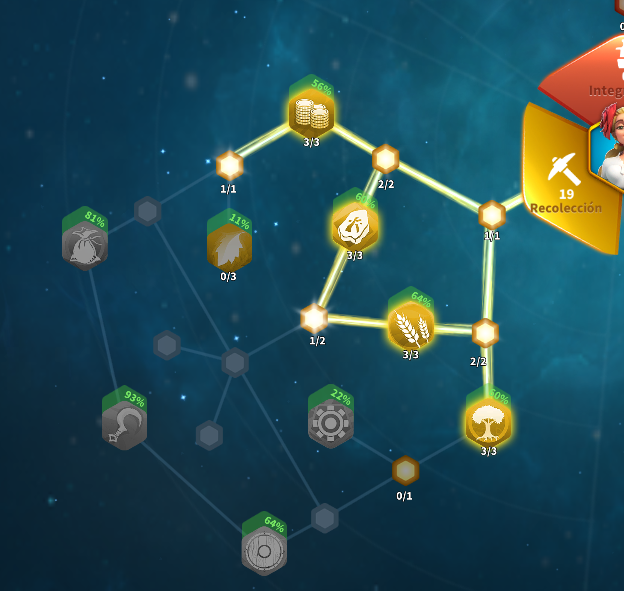
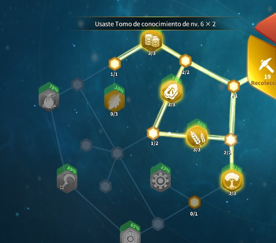
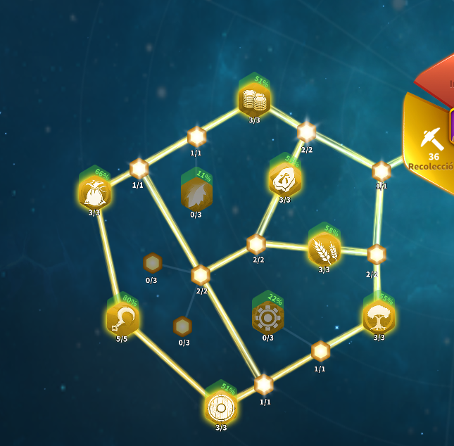
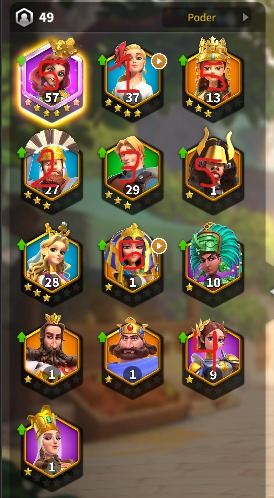

# Guide des Commandants Récolteurs

**[Español](README_es.md) | [English](README_en.md) | [Português](README_pt.md) | [Tiếng Việt](README_vi.md) | [Bahasa Indonesia](README_id.md) | Français**

Guide rapide pour monter les commandants de récolte efficacement.

## Ordre recommandé

1. Sarka
2. Caius Marius
3. Centurion
4. Jeanne d'Arc
5. Mathilde / Cleopatre / Ishida / Seondeok

## Progression conseillée

1. Monter Sarka et Caius au niveau 20.
2. Monter Centurion au niveau 20.
3. A l'Hotel de Ville 17, monter Jeanne au niveau 20.
4. Monter les 5 récolteurs au niveau 27.

## Objectifs de capacité

- Objectif intermédiaire: 630000 par marche.
- Objectif final: 1260000 par marche.

## Recommandations clés

- Utiliser les récolteurs comme commandants principaux.
- Prioriser les talents de récolte avant le combat.
- Entrainer des troupes pour augmenter la capacité de charge.

## Références visuelles

## Version complète

- [Texte complet en français](fr.txt)
