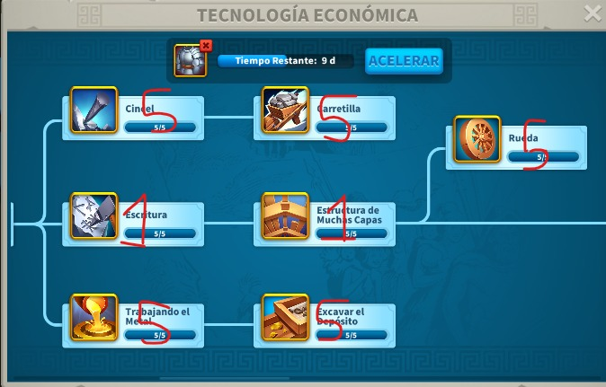

# Guía de Tecnología

**Español | [English](README_en.md) | [Português](README_pt.md) | [Tiếng Việt](README_vi.md) | [Bahasa Indonesia](README_id.md) | [Français](README_fr.md)**

Guía rápida para priorizar investigación en cuentas de farmeo y apoyo.

## Prioridad económica

1. Velocidad de recolección
2. Producción de recursos
3. Capacidad de carga
4. Velocidad de construcción
5. Velocidad de investigación

## Prioridad militar (mínima)

- Subir solo lo necesario para cumplir requisitos de edificio y progreso.
- Evitar desviar recursos de la rama económica si la cuenta es granja.

## Recomendación práctica

- Mantén investigación activa 24/7.
- Usa potenciadores en investigaciones largas.
- Coordina investigación con los objetivos de Ayuntamiento.

## Referencias visuales

